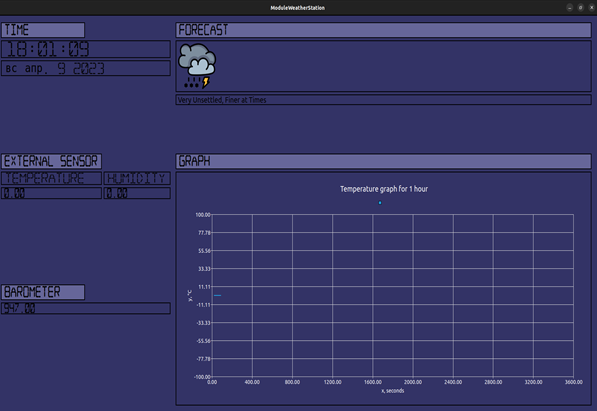
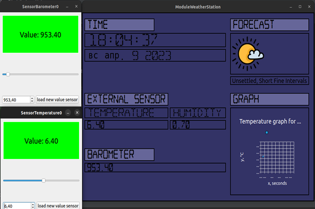
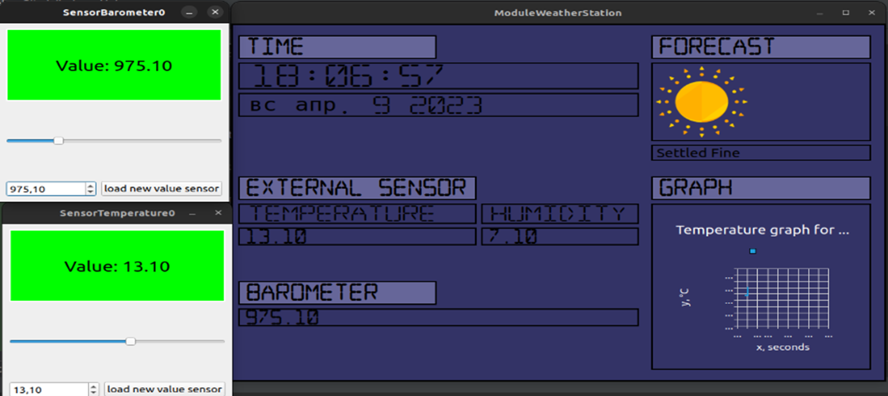

<h1 align="center">Hi 👋, I'm Sergey Makarov</h1>


<p align="left">  </p>


- 🔭 I’m currently working on [Module smart weather station](https://github.com/Sergey030520/ModuleSmartWeatherStation)

- 👨‍💻 All of my projects are available at [https://github.com/Sergey030520](https://github.com/Sergey030520)


<h3 align="left">Languages and Tools:</h3>
<p align="left"> <a href="https://www.w3schools.com/cpp/" target="_blank" rel="noreferrer">  </a> <a href="https://git-scm.com/" target="_blank" rel="noreferrer">  </a> <a href="https://www.linux.org/" target="_blank" rel="noreferrer">  </a> <a href="https://www.qt.io/" target="_blank" rel="noreferrer">  </a> </p>


# Module smart weather station

## Оглавление
1. [<p style='font-size: 20px'>Описание</p>](#description_project)
2. [<p style='font-size: 20px'>Инструкция по подключению библиотек</p>](#description_project)
3. [<p style='font-size: 20px'>Сборка проекта и тестирование</p>](#build_and_testing_project)
4. [<p style='font-size: 20px'>Интерфейс приложения</p>](#interface_project)
5. [<p style='font-size: 20px'>Пример работы программного модуля метеостанции</p>](#example_work_project)
## Описание <a name="description_project"></a>
Программный модуль представляет собой решение для считывания, обработки и отображения данных с датчиков метеостанции в режиме реального времени. Этот модуль разработан для обеспечения точной и надежной работы метеостанции, предоставляя пользователям актуальную информацию о погодных условиях.
### Основные функции программы:
#### Считывание данных с датчиков:
- Программа позволяет подключать и использовать различные типы датчиков, такие как термометр, гигрометр, барометр.
- Считывание данных происходит в режиме реального времени с высокой точностью, что позволяет получать актуальную информацию о погодных условиях.

#### Обработка данных:
- После считывания данных с датчиков, программа осуществляет их обработку, включая расчет параметров, таких как температура, влажность и давление.
- Предсказание погоды рассчитывается на основе алгоритма Замбретти.

#### Отображение данных на экране:
- Обработанные данные визуализируются на экране метеостанции в понятном и наглядном виде.
- Пользователь может увидеть текущую температуру, влажность, давление и график изменения температуры.

## Инструкция по подключению библиотек <a name="manual_connect_library"></a>

В проекте уже сгенированны два файла конфигурации:
1.  [CMakeLists.txt](https://github.com/Sergey030520/ModuleSmartWeatherStation/blob/master/CMakeLists.txt) — основной файл конфигурации и подключает библиотеку Qt5, устанавливает глобальные переменные и подключает папку src с файлами классов программы;
2.  [CMakeLists.txt](https://github.com/Sergey030520/ModuleSmartWeatherStation/blob/master/src/CMakeLists.txt) — файл конфигурации, который производит допонительную настройку проекта.

## Сборка проекта и тестирование <a name="build_and_testing_project"></a>
Данный проект был собран и протестирован с помощью компилятора g++.
Программа разработана на языке C++ 14 стандарта и 
поддерживает следующие операционную систему Ubuntu 22.10.

## Инструкция по сборке проекта <a name="manual_build_project"></a>

Сборка проекта производится с помощью инструмента [CMake](https://cmake.org/). В терминале компьютера необходимо прописать следующие команды:

```
cmake --build . --config Release --target main
```

## Интерфейс программного модуля <a name="interface_prokect"></a>

Проектирование и создание графического интерфейса приложения реализовано с помощью библиотеки Qt. Основное окно приложения состоит из 4 форм:
+ Форма с датой и временем;
+ Форма значения датчиков;
+ Форма для предсказания погоды;
+ Форма графика изменения температуры за час.



## Пример работы программного модуля метеостанции <a name="example_work_project"></a>

При запуске программы одновременно загружается эмуляция датчиков, количество которых указывается внутри программы. В начале протестируем датчик влажности и поднимим его значение с 0% до 7.10%. При изменении значения датчика давления задержки не превышали 1 сек.
 

Теперь протестируем датчик температуры и поднимим его до 6,40°C. В данном случае прогноз погоды остался тем же, а на графике произошли изменения. Задержек замечено не было, так как частота обновления не превышала 1 сек.
 
 
Далее рассмотрим случай изменения датчиков температуры и давления, где температуру поднимем до 13,10°C, а давление до 953,40 мБар. В данном случае прогноз сменился с переменно пасмурной погоды «Unsettled, Short Fine Intervals» на солнечную погоды «Settled Fine». Задержек выявлено не было, так как частота обновления не превышала 1 сек.
 

